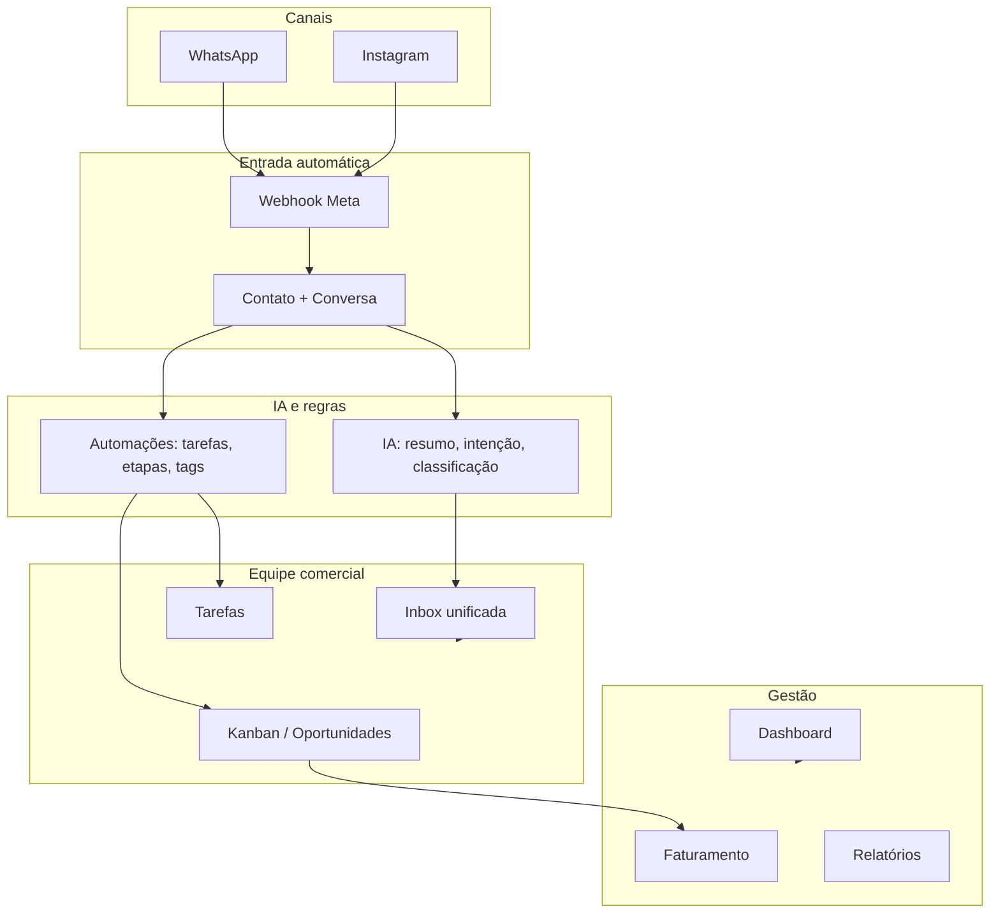

# CRM PLUS — Visão Geral

> **Documento principal para entender o produto e apresentar ao contratante.**  
> Leia na ordem das seções ou use o índice para ir direto ao tema.  
> **Versão:** 1.0.3 · **Atualizado:** 2026-05-18

---

## Índice

1. [Resumo em 30 segundos](#1-resumo-em-30-segundos)
2. [O problema e a solução](#2-o-problema-e-a-solução)
3. [Como o sistema funciona (visão do fluxo)](#3-como-o-sistema-funciona-visão-do-fluxo)
4. [Mapa de telas do sistema](#4-mapa-de-telas-do-sistema)
5. [Módulos — explicação didática](#5-módulos--explicação-didática)
6. [Inteligência Artificial](#6-inteligência-artificial)
7. [Automações](#7-automações)
8. [Integrações Meta (WhatsApp e Instagram)](#8-integrações-meta-whatsapp-e-instagram)
9. [Segurança e multi-empresa](#9-segurança-e-multi-empresa)
10. [Perfis de usuário (quem pode fazer o quê)](#10-perfis-de-usuário-quem-pode-fazer-o-quê)
11. [Roteiro de demonstração para o contratante (15–20 min)](#11-roteiro-de-demonstração-para-o-contratante-1520-min)
12. [Perguntas que o contratante costuma fazer](#12-perguntas-que-o-contratante-costuma-fazer)
13. [Glossário rápido](#13-glossário-rápido)
14. [Outros documentos](#14-outros-documentos)

---

## 1. Resumo em 30 segundos

O **CRM PLUS** é um CRM comercial **multi-empresa**, com **WhatsApp e Instagram** integrados e **IA nativa**.

A diferença central: **o sistema trabalha para o vendedor**, não o contrário.

- Mensagens chegam → contato e conversa são criados automaticamente  
- A **IA** classifica, resume, detecta intenção e sugere resposta  
- **Automações** criam tarefas, movem etapas e registram atividades  
- O vendedor **valida, responde e fecha** — sem ficar digitando cadastros o dia inteiro  

**Público ideal:** equipes com alto volume no WhatsApp/Instagram, clínicas, agências, inside sales e gestores que precisam de funil **real**, não planilha desatualizada.

---

## 2. O problema e a solução

### O problema (CRM tradicional)

| O que acontece hoje | Consequência |
|---------------------|--------------|
| Vendedor cadastra lead manualmente | Lead some se ninguém anotar |
| Ninguém atualiza o funil | Gestor não confia no pipeline |
| Follow-up depende da memória | Oportunidade esfria |
| Gestor lê conversa inteira | Perda de tempo |

### A solução (CRM PLUS)

| Situação | O que o CRM PLUS faz |
|----------|----------------------|
| Cliente manda WhatsApp/Instagram | Cria contato + conversa (webhook) |
| Cliente pede orçamento | IA detecta intenção; pode criar tarefa |
| Oportunidade parada | Cron + IA alertam leads parados |
| Vendedor abre a conversa | Vê resumo e sugestão de resposta prontos |
| Negócio ganho | Receita pode ser gerada automaticamente |

**Frase para o contratante:**  
*"O sistema age; o vendedor valida e fecha."*

---

## 3. Como o sistema funciona (visão do fluxo)

### Jornada do lead (narrativa simples)

1. **Mensagem chega** no WhatsApp ou Instagram da empresa.  
2. **Webhook** recebe, identifica a empresa (tenant) pelas credenciais salvas em Integrações.  
3. **Contato** é criado ou encontrado; **conversa** abre na Inbox.  
4. **IA** (em background): classifica lead, detecta intenção, pode sugerir resposta.  
5. **Automações** (se configuradas): criam tarefa de follow-up, registram atividade, etc.  
6. **Vendedor** vê tudo no Dashboard e na Inbox; responde (ou usa sugestão da IA).  
7. **Oportunidade** no Kanban avança (manual ou por automação/IA).  
8. **Ganho** → pode gerar **receita** no Faturamento.

---

## 4. Mapa de telas do sistema

Todas as rotas principais após login:

| Menu / Rota | Nome amigável | Para que serve |
|-------------|---------------|----------------|
| `/dashboard` | Painel inicial | KPIs, ações da IA hoje, tarefas prioritárias |
| `/contacts` | Contatos | Cadastro e gestão de pessoas (leads/clientes) |
| `/companies` | Empresas | Empresas B2B vinculadas aos contatos |
| `/products` | Produtos | Catálogo para compor oportunidades |
| `/pipeline` | Pipelines | Configurar funis e etapas |
| `/opportunities` | Oportunidades | Kanban de vendas (arrastar cards) |
| `/inbox` | Caixa de entrada | WhatsApp, Instagram, e-mail, manual — unificado |
| `/tasks` | Tarefas | Follow-ups, prioridades, origem IA/automação |
| `/billing` | Faturamento | Receitas quando oportunidade é ganha |
| `/automations` | Automações | Regras + **histórico visual** (gatilho → IA → ação) |
| `/reports` | Relatórios | Métricas comerciais |
| `/settings` | Configurações | Empresa, equipe, **agente de IA (Sara)** |
| `/settings/integrations` | Integrações Meta | Tokens WhatsApp/Instagram, webhook, status **Conectado** |
| `/team` | Equipe | Membros e perfis (se habilitado) |

**Primeiro acesso:** `/register` → cria empresa + usuário owner + pipeline + tags + 3 automações padrão.

---

## 5. Módulos — explicação didática

Cada bloco segue o mesmo formato: **o que é**, **quem usa**, **o que faz na prática**, **onde clicar**.

---

### 5.1 Autenticação e cadastro

| | |
|---|---|
| **O que é** | Login seguro por empresa (tenant). Cada empresa só vê seus dados. |
| **Quem usa** | Todos. Owner cadastra a empresa em `/register`. |
| **Na prática** | E-mail + senha; sessão com perfil (owner, gestor, vendedor…). |
| **Onde** | `/login`, `/register`, recuperação de senha |

**Ao registrar:** o sistema provisiona automaticamente pipeline (5 etapas), 5 tags e 3 automações ativas (`lib/tenant/setup.ts`).

---

### 5.2 Contatos e empresas

| | |
|---|---|
| **O que é** | Base de pessoas e empresas do CRM. |
| **Quem usa** | Vendedores e atendentes cadastram; muitos nascem sozinhos via webhook. |
| **Na prática** | Status lead/cliente/inativo; telefone (WhatsApp); external_id (Instagram); tags. |
| **Onde** | `/contacts`, `/companies` |

**IA ao criar contato:** classificação automática (quente/morno/frio) + log em `ai_logs` + automação `contact_created`.

---

### 5.3 Produtos e tags

| | |
|---|---|
| **O que é** | Catálogo e etiquetas para organizar contatos/oportunidades. |
| **Quem usa** | Gestor configura; vendedor usa nas oportunidades. |
| **Na prática** | Produtos entram no valor da oportunidade; tags filtram e segmentam. |
| **Onde** | `/products`, `/tags` |

---

### 5.4 Pipeline e oportunidades (Kanban)

| | |
|---|---|
| **O que é** | Funil visual de vendas por etapas. |
| **Quem usa** | Vendedores movem cards; gestor acompanha conversão. |
| **Na prática** | Arrastar card entre colunas (otimista na UI, com rollback se falhar); ícones de canal; tags e inatividade no card. |
| **Onde** | `/pipeline` (config), `/opportunities` (Kanban) |

**Ganhar oportunidade:** status “ganho” pode disparar receita no Faturamento.

---

### 5.5 Inbox (comunicação omnichannel)

| | |
|---|---|
| **O que é** | Todas as conversas em um lugar: WhatsApp, Instagram, e-mail, manual. |
| **Quem usa** | Atendentes e vendedores no dia a dia. |
| **Na prática** | Lista de conversas; envio com feedback de entrega; mídia e textos longos; **envio otimista** (mensagem aparece na hora). |
| **Onde** | `/inbox` |

**Painel de IA na conversa (botões):**

- Gerar resumo  
- Detectar intenção (ex.: compra imediata, orçamento, reclamação)  
- Sugerir resposta (tom profissional/amigável/empático)  

**Envio real:** usa credenciais salvas em **Integrações** por empresa (não só variáveis globais do servidor).

---

### 5.6 Tarefas

| | |
|---|---|
| **O que é** | Central de follow-ups e compromissos. |
| **Quem usa** | Vendedores; muitas tarefas vêm da IA ou automações. |
| **Na prática** | Prioridade, prazo, origem `ai` / `automation` / manual. |
| **Onde** | `/tasks`, também no Dashboard |

---

### 5.7 Faturamento

| | |
|---|---|
| **O que é** | Receitas ligadas a oportunidades ganhas. |
| **Quem usa** | Financeiro e gestores. |
| **Na prática** | Ao marcar oportunidade como ganha, receita pode ser criada automaticamente. |
| **Onde** | `/billing` |

---

### 5.8 Dashboard e relatórios

| | |
|---|---|
| **O que é** | Visão executiva do dia. |
| **Quem usa** | Gestores e owners. |
| **Na prática** | KPIs, “Ações da IA hoje”, tarefas prioritárias, atalhos. |
| **Onde** | `/dashboard`, `/reports` |

---

### 5.9 Configurações

| | |
|---|---|
| **O que é** | Dados da empresa, equipe, IA e link para integrações. |
| **Quem usa** | Owner / gestor com permissão `settings`. |
| **Na prática** | Nome da empresa; membros e perfis; **Agente de IA** (nome, tom, prompt); botão para Integrações Meta. |
| **Onde** | `/settings` |

---

## 6. Inteligência Artificial

### O que a IA faz hoje

| Ação | Quando roda | O que o usuário vê |
|------|-------------|-------------------|
| **Classificar lead** | Novo contato | Score quente/morno/frio, tags sugeridas |
| **Detectar intenção** | Botão na conversa | “Compra imediata”, “Orçamento”, etc. |
| **Resumir conversa** | Botão na conversa | Resumo + bullet points |
| **Sugerir resposta** | Botão na conversa | Texto pronto para enviar |
| **Detectar leads parados** | Cron (produção) | Tarefas/alertas |
| **Sugerir próxima ação** | Após enviar mensagem | Background |

Tudo fica registrado em **`ai_logs`** — auditável no Dashboard e na aba **IA** em Automações.

### Agente configurável (ex.: “Sara”)

Em **Configurações → Empresa → Agente de IA**:

- Nome do agente  
- Tom (profissional, amigável, empático, direto)  
- Contexto da empresa  
- Prompt do sistema  
- **Testar prompt** (simulação antes de salvar)  

Essas configurações são usadas **de verdade** nas ações de IA (detectar intenção, resumo, sugestão, classificar lead) via `tenant.settings.ai`.

### Provedores de IA

| Modo | Uso |
|------|-----|
| `mock` | Desenvolvimento e demo sem custo de API |
| `gemini` / `claude` | Produção com chaves no `.env` |

---

## 7. Automações

### Conceito

**Gatilho** (algo aconteceu) → **condições** (opcional) → **ações** (o sistema executa).

### Gatilhos disponíveis

- Contato criado / status alterado  
- Conversa criada  
- Oportunidade criada / status alterado / etapa alterada  
- Tarefa criada  
- Status de receita alterado  

### Ações disponíveis

- Criar tarefa  
- Adicionar tag  
- Atualizar status do contato  
- Registrar atividade  
- Enviar WhatsApp / Instagram  
- Mover oportunidade de etapa  

### O que o contratante vê em `/automations`

1. **Regras configuradas** — lista com gatilho, ações, ativa/pausada.  
2. **Painel de execução** com duas abas:  
   - **Automações** — timeline por execução:  
     - Gatilho disparado  
     - IA analisou intenção como: … (quando houver `ai_log` correlacionado)  
     - Ação executada: … (texto legível, ex. “Movido para etapa Hot”)  
     - Badge: Sucesso / Falhou / Ignorado  
   - **IA** — últimas ações de IA da empresa  

### Automações no primeiro dia

Ao criar a empresa, já existem **3 regras ativas** (provisionamento automático).

---

## 8. Integrações Meta (WhatsApp e Instagram)

### Por que isso importa

Sem integração, o CRM é só cadastro manual. **Com integração**, mensagens entram e saem pelo número oficial da empresa.

### Onde configurar

**Configurações → Integrações Meta** (`/settings/integrations`)

### Campos por canal

| WhatsApp | Instagram |
|----------|-----------|
| Phone Number ID | Page ID (Instagram Business) |
| Access Token | Access Token |
| Verify Token (webhook) | Verify Token (webhook) |

### O que cada peça faz

| Campo | Função |
|-------|--------|
| **Phone Number ID / Page ID** | Meta sabe qual empresa (tenant) é dona da mensagem |
| **Access Token** | Enviar mensagens pela API |
| **Verify Token** | Validar assinatura do webhook no painel Meta (o CRM compara com o valor salvo) |
| **URL do Webhook** | Copiar com um clique (“Copiado!”) e colar no app Meta |

### Status visual

| Badge | Significado |
|-------|-------------|
| **Conectado** (verde) | Todos os campos obrigatórios salvos |
| **Incompleto** (âmbar) | Falta algum campo |
| **Não configurado** | Empty state convidando a configurar |

### Fluxo recomendado para o contratante

1. Criar app em [developers.facebook.com](https://developers.facebook.com/apps)  
2. Copiar **URL do Webhook** do CRM  
3. Colar no Meta + usar o **mesmo Verify Token** nos dois lados  
4. Preencher tokens no CRM → Salvar → ver **Conectado**  
5. Enviar mensagem de teste → aparecer na **Inbox**  

**Produção:** não é necessário `?tenantId` na URL — o tenant é resolvido pelo Phone Number ID / Page ID.

---

## 9. Segurança e multi-empresa

| Tema | Como funciona |
|------|----------------|
| **Isolamento** | Cada empresa (tenant) só acessa seus dados |
| **APIs** | `tenantId` vem da sessão, nunca do body do cliente |
| **Páginas** | Verificação de sessão e permissão por módulo |
| **Webhooks** | Em produção, tenant por credencial; sem “adivinhar” tenant na URL |
| **Credenciais Meta** | Salvas por tenant; envio e verificação usam o que foi configurado na UI |
| **Demo seed** | Desativado em produção |

Detalhes técnicos: [SDD.md](./SDD.md) (segurança v1.0.2+).

---

## 10. Perfis de usuário (quem pode fazer o quê)

| Perfil | Em português | Uso típico |
|--------|--------------|------------|
| `owner` | Dono da conta | Tudo, incluindo integrações e equipe |
| `manager` | Gestor | Equipe, relatórios, pipeline |
| `salesperson` | Vendedor | Contatos, oportunidades, inbox |
| `attendant` | Atendente | Inbox e contatos |
| `financial` | Financeiro | Faturamento |
| `viewer` | Visualizador | Só leitura |

Permissões granulares por módulo (`read`, `create`, `update`, `delete`) — ver SDD se precisar de matriz completa.

---

## 11. Roteiro de demonstração para o contratante (15–20 min)

Use esta ordem na reunião. Ajuste o tempo conforme reações.

| Min | O que mostrar | O que dizer |
|-----|---------------|-------------|
| 0–2 | **Problema + frase** | “CRM tradicional: vendedor alimenta planilha. Aqui o sistema alimenta o vendedor.” |
| 2–4 | `/register` ou empresa já criada | “Ao criar a empresa, já vem funil, tags e automações prontas.” |
| 4–6 | `/dashboard` | “KPIs do dia e tudo que a IA fez — transparente.” |
| 6–9 | `/settings/integrations` | “Conectamos WhatsApp: copia webhook, tokens, badge Conectado. Verify Token igual nos dois lados.” |
| 9–12 | Webhook ou conversa já existente → `/inbox` | “Mensagem entrou sozinha. Resumo, intenção, sugestão de resposta.” |
| 12–14 | `/opportunities` | “Funil visual; arrastar etapa; ao ganhar, vai pro faturamento.” |
| 14–16 | `/automations` | “Timeline: gatilho → IA → ação. Gestor vê o que o sistema fez.” |
| 16–18 | `/settings` → Agente IA | “Personaliza Sara: tom, contexto, testar prompt antes de salvar.” |
| 18–20 | Perguntas + próximos passos | Ver seção 12 abaixo |

**Dica:** deixe o `AI_PROVIDER=mock` na demo se não quiser depender de API paga; o fluxo funciona igual.

---

## 12. Perguntas que o contratante costuma fazer

**“Precisa do WhatsApp Business API?”**  
Sim, para produção com número oficial. Em desenvolvimento dá para simular webhooks e inbox.

**“A IA substitui o vendedor?”**  
Não. Ela qualifica, resume e sugere; o humano valida e fecha.

**“Vários vendedores na mesma empresa?”**  
Sim. Um tenant, vários usuários com perfis diferentes.

**“Várias empresas no mesmo sistema?”**  
Sim. Multi-tenant: cada cliente/contratante é um tenant isolado.

**“Como sei que a integração funcionou?”**  
Badge **Conectado** + mensagem de teste na Inbox + log de automação se aplicável.

**“E se errar o token?”**  
Status incompleto ou falha no envio; mensagem de erro na entrega. Corrige em Integrações e salva de novo (merge — não apaga campos antigos).

**“LGPD / dados?”**  
Dados por tenant no PostgreSQL; credenciais no JSON da integração (planejar criptografia em camada de app para hardening futuro).

**“Quanto custa a IA?”**  
Depende do provedor (Gemini/Claude). Modo mock para demo sem custo.

---

## 13. Glossário rápido

| Termo | Significado |
|-------|-------------|
| **Tenant** | Empresa/cliente no sistema (multi-empresa) |
| **Lead / Contato** | Pessoa em prospecção ou cliente |
| **Oportunidade** | Negócio em andamento no funil |
| **Pipeline / Etapa** | Colunas do Kanban (ex.: Proposta, Negociação) |
| **Webhook** | Meta avisa o CRM quando chega mensagem |
| **PSID** | ID do usuário no Instagram para mensagens |
| **Phone Number ID** | ID do número WhatsApp na Meta |
| **Verify Token** | Senha de verificação do webhook (Meta ↔ CRM) |
| **ai_logs** | Histórico de decisões da IA |
| **automation_logs** | Histórico de execuções de automação |

---

## 14. Outros documentos

| Documento | Quando usar |
|-----------|-------------|
| **[README.md](./README.md)** | Instalar, rodar local, variáveis de ambiente |
| **[GUIA-DE-TESTES.md](./GUIA-DE-TESTES.md)** | Passo a passo técnico para validar cada módulo |
| **[SDD.md](./SDD.md)** | Design completo, banco, APIs, fases (equipe técnica) |

---

### Comparativo rápido (slide mental)

| Tarefa | CRM tradicional | CRM PLUS |
|--------|-----------------|----------|
| Cadastrar lead | Manual | Automático (webhook) |
| Entender conversa | Ler tudo | IA resume |
| Avançar funil | Arrastar card | Automação + IA + manual |
| Follow-up | Lembrar | Tarefa IA/automação |
| Configurar Meta | Planilha de tokens | Tela Integrações + status Conectado |
| Explicar o que o sistema fez | Não sabe | Timeline em Automações |

---

*CRM PLUS — Sistema Operacional Comercial Autônomo · Documento de visão v1.0.3*
